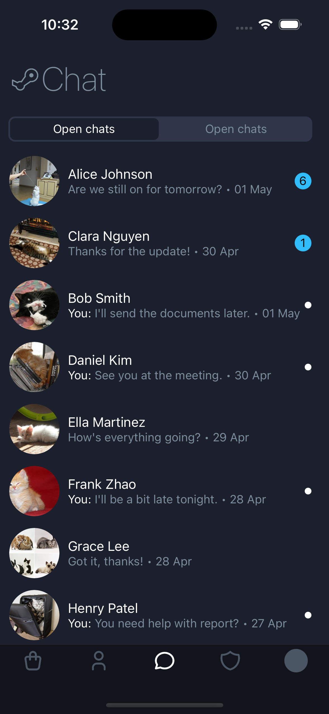

Лабораторна робота №2

Команди для запуску

```bash
# встановити yarn
npm i yarn
# встановити залежності
yarn
# запуск 
yarn android
```

Для зміни колірної схеми її потрібно змінити в телефоні

Темна тема

<div style="flex-direction: row">
   
   
   
   
   
</div>

Світла тема

<div style="flex-direction: row">
   
   
   
   
   
</div>
