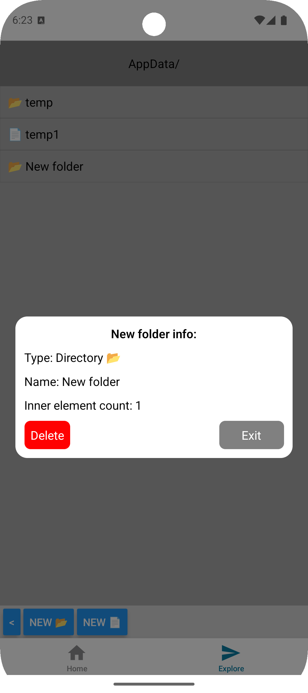

Лабораторна робота №3

Команди для запуску

```bash
# встановити yarn
npm i yarn
# встановити залежності
yarn
# запуск 
yarn android
```

! Для відкриття інформації про файл/каталог потрібно затиснути елемент

<div style="flex-direction: row">
   
   
   
   
   
   
   
</div>
